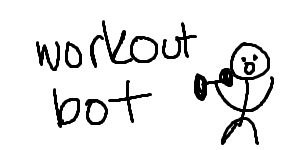

<div align="center">
  
  
  <p align="center">
    <strong>lil discord bot </strong>
  </p>
  
  <p align="center">
    
    
    
  </p>
</div>

## 🚀 Features

### 🔥 **Daily Streak Tracking**
- Maintain your fitness momentum with daily check-ins
- Streak reset at midnight if not checked in

### 💪 **Workout Management**
- Create and store custom workout splits
- Log detailed workout sessions with exercises, sets, and reps

### 🏆 **Personal Records**
- Track your maximum lifts across different exercises
- Automatic PR detection and celebration

### 📊 **Nutrition Support**
- Built-in maintenance calorie calculator
- Personalized recommendations based on your stats

## 🛠️ Installation

### Prerequisites
- Node.js v18 or higher
- Discord application with bot token
- Discord server with appropriate permissions

### Setup Steps

1. **Clone the repository**
   ```bash
   git clone https://github.com/yourusername/workout-bot.git
   cd workout-bot
   ```

2. **Install dependencies**
   ```bash
   npm install
   ```

3. **Environment Configuration**
   ```bash
   cp .env.example .env
   ```
   
   Edit `.env` with your configuration:
   ```env
   DISCORD_TOKEN=your_bot_token_here
   CLIENT_ID=your_client_id_here
   GUILD_ID=your_guild_id_here (optional, for guild-specific commands)
   ```

4. **Start the bot**
   ```bash
   npm start
   ```

## 🎯 Commands

### Core Commands
| Command | Description | Usage |
|---------|-------------|--------|
| `/checkin` | Check in for your daily streak | `/checkin` |
| `/rest` | Mark today as a rest day (maintains streak) | `/rest` |
| `/streak` | View your current streak | `/streak` |

### Workout Commands
| Command | Description | Usage |
|---------|-------------|--------|
| `/workout start` | Begin a new workout session | `/workout start [split-name]` |
| `/workout log` | Log an exercise | `/workout log [exercise] [sets] [reps] [weight]` |
| `/workout finish` | Complete your workout | `/workout finish` |
| `/splits create` | Create a new workout split | `/splits create [name]` |
| `/splits view` | View your workout splits | `/splits view [name]` |

### Tracking Commands
| Command | Description | Usage |
|---------|-------------|--------|
| `/pr set` | Update a personal record | `/pr set [exercise] [weight]` |
| `/pr view` | View your personal records | `/pr view [exercise]` |
| `/calories` | Calculate maintenance calories | `/calories [age] [weight] [height] [activity-level]` |

## 📸 Screenshots

<div align="center">
  
  
</div>

## 🏗️ Project Structure

```
workout-bot/
├── src/
│   ├── commands/
│   │   ├── checkin.js
│   │   ├── workout.js
│   │   └── calories.js
│   ├── events/
│   │   ├── ready.js
│   │   └── interactionCreate.js
│   ├── utils/
│   │   ├── database.js
│   │   └── calculations.js
│   └── index.js
├── assets/
│   ├── logo.png
│   └── screenshots/
├── .env.example
├── package.json
└── README.md
```

## 🤝 Contributing

We welcome contributions! Here's how you can help:

1. **Fork the repository**
2. **Create a feature branch**
   ```bash
   git checkout -b feature/amazing-feature
   ```
3. **Commit your changes**
   ```bash
   git commit -m 'Add some amazing feature'
   ```
4. **Push to the branch**
   ```bash
   git push origin feature/amazing-feature
   ```
5. **Open a Pull Request**

### Development Guidelines
- Follow the existing code style
- Add tests for new features
- Update documentation as needed
- Ensure all tests pass before submitting

## 📝 License

This project is licensed under the MIT License - see the [LICENSE](LICENSE) file for details.

## 🔗 Links

- [Discord.js Documentation](https://discord.js.org/#/docs/discord.js/stable/general/welcome)
- [Discord Developer Portal](https://discord.com/developers/applications)

---
